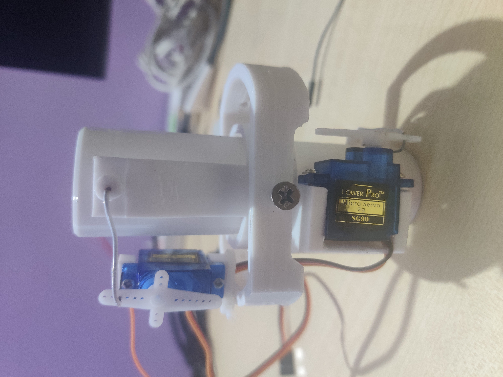

# Actively stabilised TVC-Flight_controller
Learn more about TVC 

 https://en.wikipedia.org/wiki/Thrust_vectoring

Ardunio Thrust vectoring and flight control module . 

# Components 
.MPU6050 
.BMP180 
.ARDUNIO UNO 
.LED 
.BUZZER 
.SD CARD READER 
.9g SERVO 
.BATTERY PACK 

# TVC MOUNT

  

# FLIGHT CONTROLLER

  

  

  

