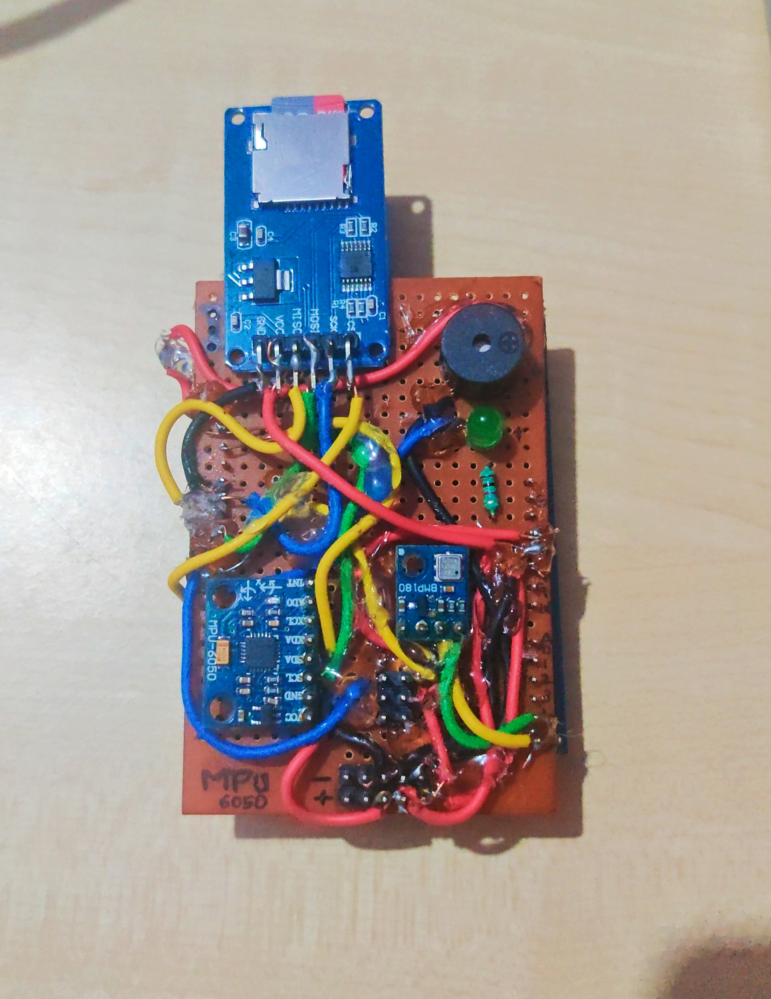

# Actively stabilised TVC-Flight_controller
learn more about TVC 

 https://en.wikipedia.org/wiki/Thrust_vectoring

Ardunio Thrust vectoring and flight control module . 

# Components 
.MPU6050
.BMP180
.ARDUNIO UNO
.LED
.BUZZER
.SD CARD READER

# TVC MOUNT

  

# FLIGHT CONTROLLER

  

